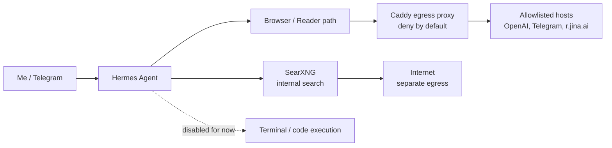

# Project Walkthrough — Hermes Airlock

**Video link:** _paste your Loom (or similar) URL here_

## Project

Hermes Airlock is a personal AI-agent stack I built to run a 24/7 assistant through Telegram, with useful web capabilities but constrained security boundaries.

The goal was not to give the agent every possible tool. The goal was to decide which capabilities were safe enough to run continuously, and to add stronger boundaries before enabling riskier ones.

I plan to open-source the stack once I finish validating it, remove/templating any sensitive configuration, and make the setup reproducible for other people.

## Architecture

## Walkthrough Outline

### 1. Context

- I wanted a personal AI assistant that could run continuously and interact with me through Telegram.
- It needed memory, web search, page reading, and eventually more advanced tools.
- The hard part was not just making the agent work. The hard part was deciding what it should not be allowed to do yet.

### 2. Architecture

- Hermes is the main agent.
- Telegram is the main user interface.
- SearXNG runs as an internal search service.
- Page reading currently goes through a constrained reader path.
- Browser traffic is routed through a Caddy egress proxy.
- The proxy is deny-by-default: the agent can only reach hosts I explicitly allow.
- Docker networks separate the agent, search, and external egress paths.

### 3. Hard Technical Decision

- I considered more policy-grade options like NemoClaw / NemoHermes / OpenShell.
- The tradeoff was that I wanted to keep ChatGPT/Codex OAuth compatibility and avoid introducing a heavier platform before I had validated the workflow.
- I chose Hermes for the first version, but wrapped it in an "airlock": restricted egress, allowlisted destinations, no terminal/code execution yet, and a tiered roadmap for enabling capabilities safely.
- This was a deliberate product/engineering tradeoff: ship a useful version now, but keep risky capabilities behind explicit boundaries.

### 4. Security

- I treated web content as untrusted input.
- Prompt-level defenses help, but they are not enough by themselves.
- The important boundary is network-level: the agent does not have unrestricted internet access.
- The stack uses:
    - deny-by-default egress through Caddy;
    - allowlisted external hosts;
    - separate Docker networks;
    - no published ports for internal services;
    - Telegram allowed users;
    - manual approvals for sensitive actions;
    - terminal/code execution disabled for now.
- The security model is defense-in-depth, not "one perfect prompt".

### 5. Performance and Scalability

- At this stage, scalability mostly means operational reliability, not serving many users.
- Search is separated into SearXNG instead of being embedded inside the agent.
- STT uses a local cached model so repeated restarts do not redownload it.
- The architecture is tiered: I can add stronger components later, such as a local reader adapter or sandboxed code execution, without redesigning everything.

### 6. What I Would Do Differently

- I would build the reader adapter earlier so page extraction does not depend on an external reader service.
- I would add stronger post-deploy validation and alerts around blocked egress attempts.
- I would evaluate sandboxed code execution earlier, but still keep it disabled by default until the boundary is clear.
- I would make the eventual open-source version reproducible from the beginning: clean templates, generated secrets, and a safer first-run checklist.

### 7. Future Direction

- Finish validating the current Tier 2 setup.
- Replace the external reader path with a local reader adapter.
- Evaluate a policy-grade execution layer for code/terminal work.
- Open-source the stack once secrets, config, and deployment docs are cleaned up.
